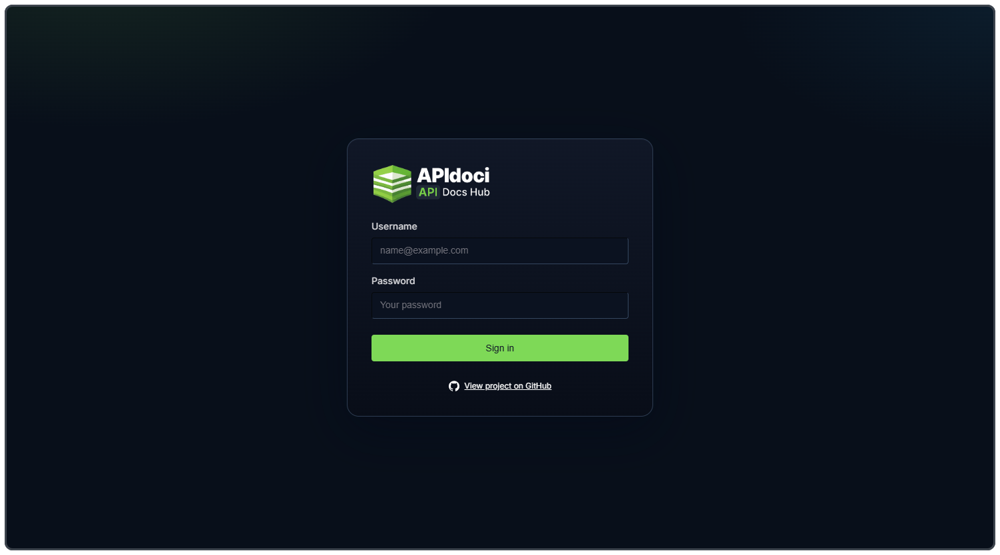
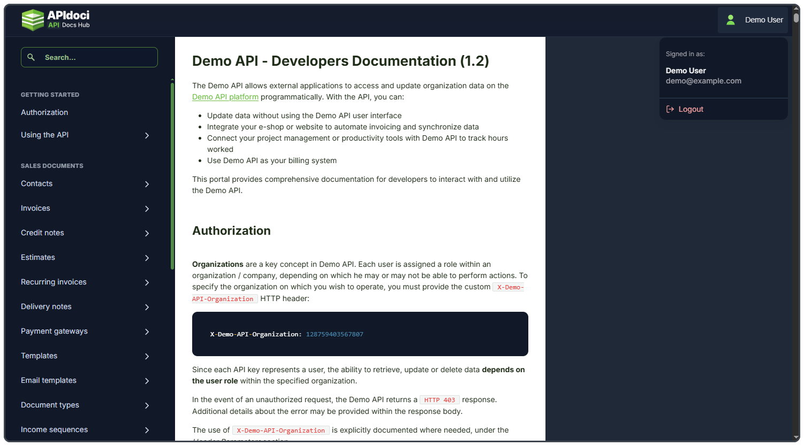
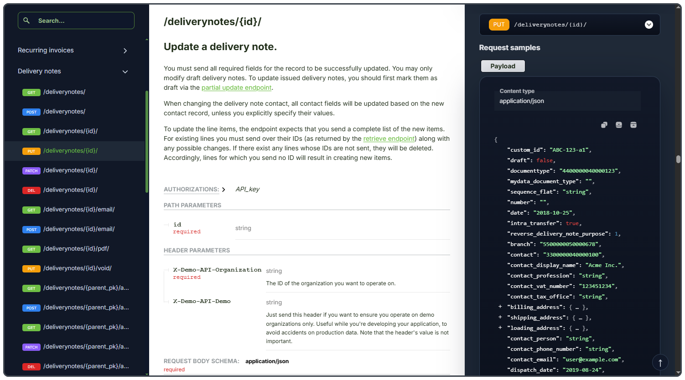

# APIdoci: API Documentation Hub


A documentation hub for sharing API specs with authorized users only. Users log in with their credentials, and once verified they get access to a custom-themed ReDoc interface.

🔗 [api-doci.vercel.app](https://api-doci.vercel.app)

**Demo account:**
- Username: `demo@example.com`
- Password: `demo123`

---

## How It Works

When a user logs in, the credentials are verified against an external auth API. On success the server writes an encrypted session cookie and the docs page stays protected behind it. A `SessionActivityGuard` runs in the background to keep the session alive and logs the user out on inactivity.

The OpenAPI spec is never exposed publicly. It's served through `/api/spec`, which only responds to authenticated requests. The spec source is configurable via `OPENAPI_SPEC_SOURCE` and supports both a local file path and a remote URL, falling back to a bundled demo spec when unset.

## Screenshots
<p>
  
  
  
</p>

## Tech Stack

- Next.js App Router + Route Handlers
- React + TypeScript
- Chakra UI v3 + Emotion
- React Hook Form
- ReDoc (standalone bundle, custom themed)
- Encrypted HTTP-only cookie sessions

## API Routes

| Route | Method | Description |
|-------|--------|-------------|
| `/api/auth/login` | POST | Validates credentials, calls upstream auth, writes session cookie |
| `/api/auth/activity` | POST | Refreshes activity timestamp and cookie TTL |
| `/api/auth/logout` | POST | Calls upstream logout and clears local cookie |
| `/api/spec` | GET | Returns parsed OpenAPI JSON for authenticated sessions only |

**Upstream auth calls:**
- `POST {AUTH_API_BASE_URL}/login`
- `POST {AUTH_API_BASE_URL}/GetLoggedUser`
- `POST {AUTH_API_BASE_URL}/LogoutUser`


## Session Security

Sessions are stored in an encrypted HTTP-only cookie with a configurable inactivity timeout. The login form also includes a honeypot field and a minimum submit delay to keep out basic bots.

## Environment Variables

```bash
# URL ReDoc uses to fetch the spec
NEXT_PUBLIC_OPENAPI_URL=/api/spec

# Source for /api/spec (local path or absolute http/https URL)
OPENAPI_SPEC_SOURCE=private/demo.json

# Upstream auth service base URL
AUTH_API_BASE_URL=http://your-auth-api

# Application name sent to upstream auth API
AUTH_APPLICATION_NAME=your-app-name

# Optional fixed session ID (useful for mock matching)
AUTH_DEMO_SESSION_ID=

# Secret for encrypting/decrypting the session cookie
AUTH_SESSION_SECRET=replace-with-a-long-random-secret

# Cookie name
AUTH_SESSION_COOKIE_NAME=api_doci_auth

# Inactivity timeout in minutes
SESSION_INACTIVITY_MINUTES=30

# Minimum time before login submit is accepted (anti-bot)
LOGIN_MIN_SUBMIT_MS=1200
```

Notes:
- `AUTH_API_BASE_URL` can be provided with or without protocol, the app normalizes it
- `AUTH_SESSION_SECRET` must be explicitly set in production

---

## Local Setup

1. Install dependencies
   ```bash
   npm install
   ```

2. Configure environment
   ```bash
   cp .env.example .env.local
   # fill in variables above
   ```

3. Run the dev server
   ```bash
   npm run dev
   ```

4. Open `http://localhost:3000/login`

---

## License

Personal project. Non-commercial use only.
